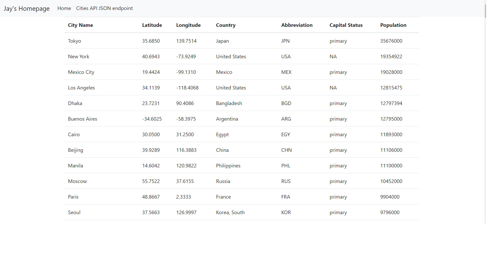

# Project Description
This Project is a homework assignment to learn how to get Pycharm setup with Docker, Flask, MySQL

### 1) SQL Data Screenshot

### 2) Postman Screenshot

### 3) Part 2 Screenshot - App running on browser

### 4) Link to Part 3: [Click Here]()
