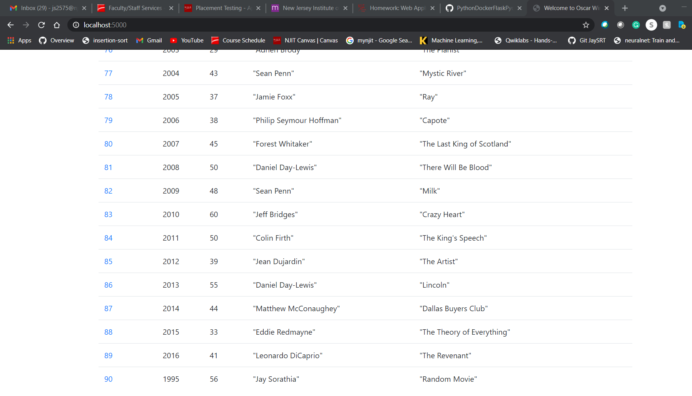

# Project Description
This Project is a homework assignment to create a webApp setting up Pycharm with Docker, Flask and MySQL

### 1) The project showing that you can view YOUR data tables in pycharm:

### 2) YOUR project running correctly in the browser displaying your homepage with your data

### 3) YOUR project running correctly in the browser displaying your data record as a view of one record

### 4) YOUR project running correctly in the browser displaying a new record added to your home page

### 5) YOUR project running correctly in the browser displaying an updated record added to your homepage

### 6) YOUR project running correctly in the browser displaying a deleted record added to your homepage

## Link to the Submission Word file: [Click Here!](Part_3-webapp.docx)